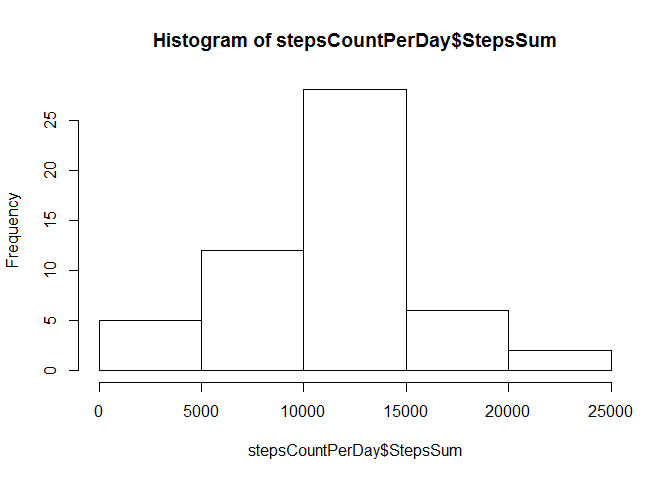
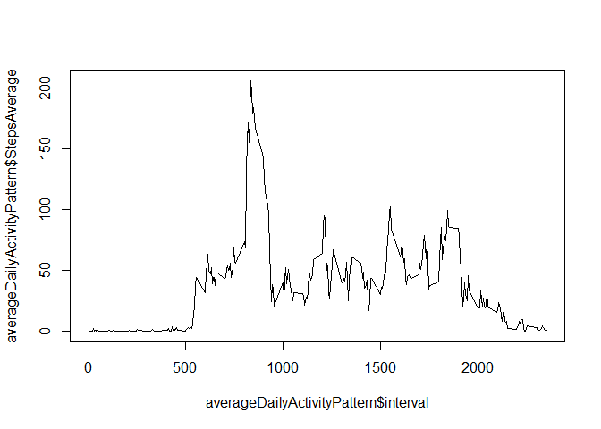
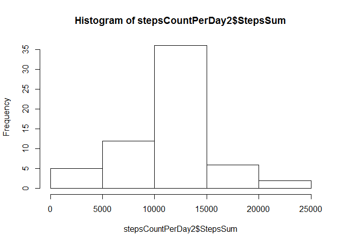
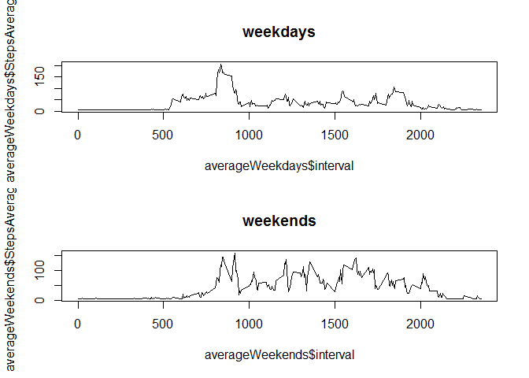

# Reproducible Research: Peer Assessment 1


## Loading and preprocessing the data

```r
library(sqldf)
```

```
## Loading required package: gsubfn
## Loading required package: proto
## Loading required package: RSQLite
## Loading required package: DBI
## Loading required package: RSQLite.extfuns
```

```r
dataFile <- read.csv("activity.csv")
dataFileRemoveNa <- na.omit(dataFile)
```


## What is mean total number of steps taken per day?

```r
stepsCountPerDay <- sqldf("SELECT date, SUM(steps) AS StepsSum FROM dataFileRemoveNa GROUP BY date")
```

```
## Loading required package: tcltk
```

```r
hist(stepsCountPerDay$StepsSum)
```

 

```r
stepsMean <- format(mean(stepsCountPerDay$StepsSum), nsmall=2)
stepsMedian <- format(median(stepsCountPerDay$StepsSum), nsmall=2)
```
The mean number of steps taker per day is 10766.19.  The median number of steps taken per day is 10765.


## What is the average daily activity pattern?

```r
averageDailyActivityPattern <- sqldf("SELECT interval, AVG(steps) AS StepsAverage FROM dataFileRemoveNa GROUP BY interval")
plot(averageDailyActivityPattern$StepsAverage~averageDailyActivityPattern$interval, type="l")
```

 

```r
highestValueRow <- sqldf("SELECT interval, MAX(StepsAverage) FROM averageDailyActivityPattern")
highestInterval <- highestValueRow$interval
```
The 5-minute interval that contains the maximum number of steps, on average across all days in the dataset, is 835.

## Imputing missing values

```r
dataFile2 <- dataFile[!complete.cases(dataFile),]
missingValueCount <- nrow(dataFile2)
averageStepsPerInterval <- mean(dataFileRemoveNa$steps)
dataFileFixedNa <- dataFile
dataFileFixedNa$steps[is.na(dataFileFixedNa$steps)] <- averageStepsPerInterval
```
The total amount of rows with missing content is 2304.

For our secondary analysis, I will plug in the average amount of steps take in a given interval, which is 37.3825996.


```r
stepsCountPerDay2 <- sqldf("SELECT date, SUM(steps) AS StepsSum FROM dataFileFixedNa GROUP BY date")
hist(stepsCountPerDay2$StepsSum)
```

 

```r
stepsMean2 <- format(mean(stepsCountPerDay2$StepsSum), nsmall=2)
stepsMedian2 <- format(median(stepsCountPerDay2$StepsSum), nsmall=2)
```
In this secondary analysis, the mean number of steps taker per day is 10766.19.  The median number of steps taken per day is 10766.19.


## Are there differences in activity patterns between weekdays and weekends?

```r
WeekendOrWeekday <- function(inputDate){
  dayOfWeek <- weekdays(inputDate)
  if ((dayOfWeek == "Saturday") || (dayOfWeek == "Sunday")){
    return(0)
  }
  else {
    return(1)
  }
}
dataFileFixedNa$weekday <- lapply(as.Date(dataFileFixedNa$date), WeekendOrWeekday)

weekdays <- dataFileFixedNa[dataFileFixedNa$weekday==1, c("interval", "steps")]
weekends <- dataFileFixedNa[dataFileFixedNa$weekday==0, c("interval", "steps")]

averageWeekdays <- sqldf("SELECT interval, AVG(steps) as StepsAverage FROM weekdays GROUP BY interval")
averageWeekends <- sqldf("SELECT interval, AVG(steps) as StepsAverage FROM weekends GROUP BY interval")


par(mfrow=c(2,1))
plot(averageWeekdays$StepsAverage~averageWeekdays$interval, type="l", main="weekdays")
plot(averageWeekends$StepsAverage~averageWeekends$interval, type="l", main="weekends")
```

 

